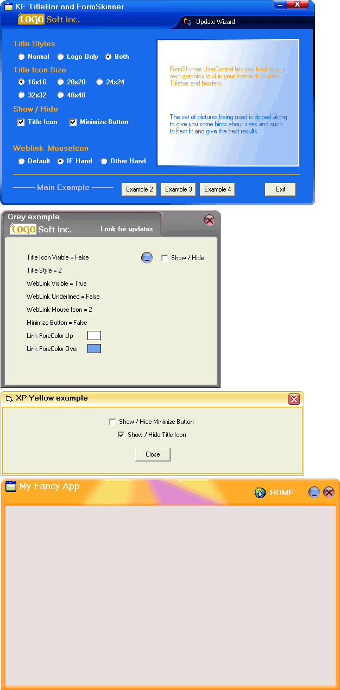



## KE FormSkinner AX for GUI apps

### Description

FormSkinner UserControl lets you create and load-in your own graphics to skin your form with custom Titlebar and borders. There are surtain rules for the graphics, but you'll get a good idea if you check the included pics. (I know this will increase the size of the download, but it's helpful. At least for beginners. In that matter... use "folder names" when extracting) You can also put your Company Logo up along with the caption and icon. Link to web is also included... Added for the "Online Update" purpose. There is more useful properties that can make your form(s) innovative. Thanks!
 
### More Info
 

             |
---                |---
**Submitted On**   |2008-11-05 17:00:10
**By**             |[u32](https://github.com/Planet-Source-Code/PSCIndex/blob/master/ByAuthor/u32.md)
**Level**          |Intermediate
**User Rating**    |4.8 (19 globes from 4 users)
**Compatibility**  |VB 5\.0, VB 6\.0
**Category**       |[Custom Controls/ Forms/  Menus](https://github.com/Planet-Source-Code/PSCIndex/blob/master/ByCategory/custom-controls-forms-menus__1-4.md)
**World**          |[Visual Basic](https://github.com/Planet-Source-Code/PSCIndex/blob/master/ByWorld/visual-basic.md)
**Archive File**   |[KE\_FormSki2133401172008\.zip](https://github.com/Planet-Source-Code/u32-ke-formskinner-ax-for-gui-apps__1-71366/archive/master.zip)

